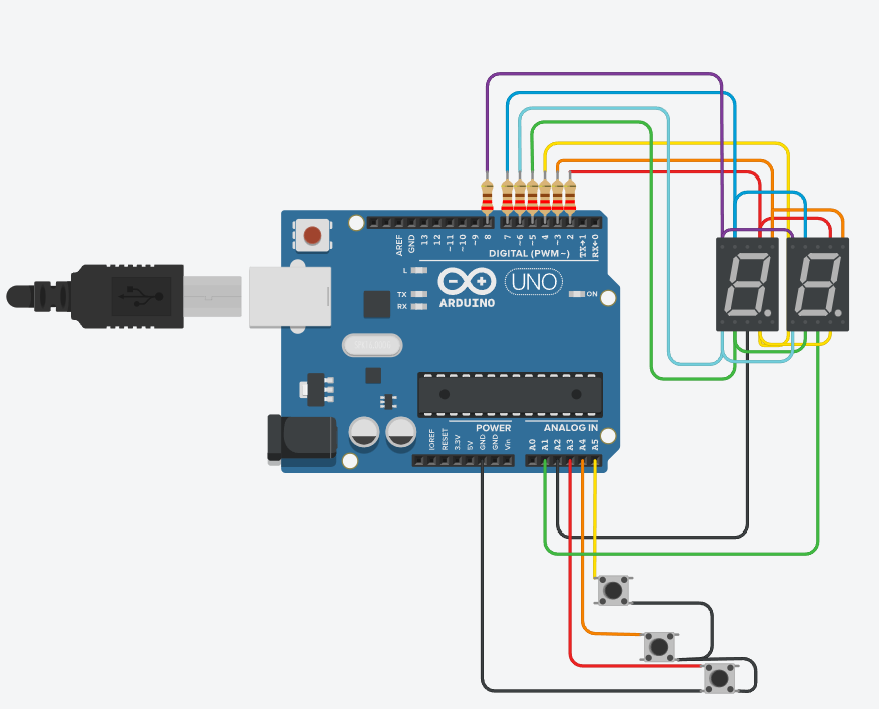
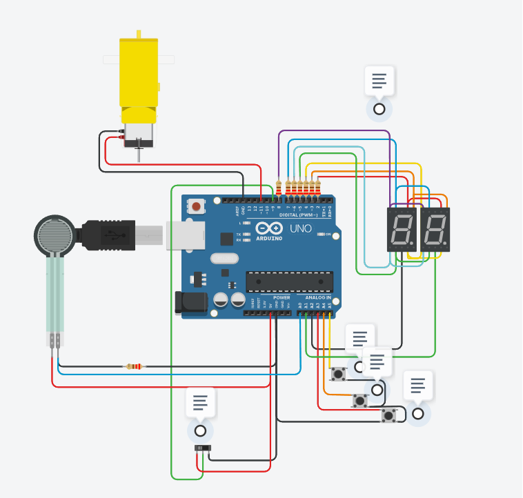
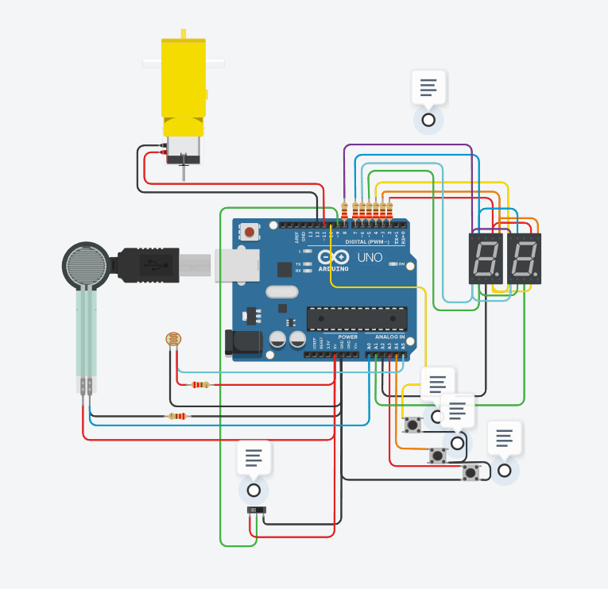

# Parcial domiciliario

## Integrantes 
- Matias Flores
- Lorenzo Buero
- Sol Ghiglieri
- Gabriel Garcia

## Parte 1

## Descripción
Es un contador de 2 dígitos hecho con dos displays de 7 segmentos que funcionan a través de multiplexación, que cuenta con los botones sumar, restar y resetear. 

## Función principal
Tiene varias funciones importantes, pero esta es la que se encarga de la multiplexación.

dibujarNumero esta mostrando en los dos display la unidad, en la linea siguiente se apaga el display que representa la decena y luego se apagan ambos. Esto mismo sucede con la decena.

Todo esto ocurre con un delay de 10 milisegundos, y por eso da la ilusión al ojo humano que son dos contadores con valores distintos, cuando en realidad tienen 1 y se van alternando y apagando.

~~~ C (lenguaje en el que esta escrito)
void secuenciaDisplays()
{
  dibujarNumero(contador - 10 * int(contador/10)); // Escribe la unidad en los dos display
  prenderApagarDisplay(UNIDAD); // Apaga la decena, prende las unidades
  prenderApagarDisplay(0); // Borra el numero
  
  dibujarNumero(contador/10); // Calcula la decena
  prenderApagarDisplay(DECENA); // Apaga la unidad, prende solo la decena
  prenderApagarDisplay(0); // Borra el numero
}
~~~

## Parte 2

## Descripción
En esta parte se agrega un switch para solo mostrar numeros primos, o mostrar como la versión anterior. También se agrega un sensor de fuerza y un motor. Si la fuerza aplicada al sensor es mayor o igual al contador de los displays, el motor se va a encender.

## Funciones principales

Lee el estado del switch y si está encendido muestra los números normalmente, caso contrario hace el cálculo para saber si el número actual es primo, solo si esto es así lo muestra en los displays.

~~~ C (lenguaje en el que esta escrito)
void mostrarDependiendoSwitch()
{
  estadoInterruptor = digitalRead(INTERRUPTOR);
  
  if (estadoInterruptor)
  {
    secuenciaDisplays();
  }
  else
  {
    int divisores = 0;
    
    for (int i = 1; i <= contador; i++)
    {
      if (contador % i == 0)
      {
		divisores++;
      }
    }
    
    if (divisores == 2)
    {
      secuenciaDisplays();
    }
  }
}
~~~

Lee el estado del sensor y lo mapea para que tenga el mismo
rango que el contador. Lo muestra en el monitor en serie.
Si el resultado mapeado es mayor o igual que el numero que está
en el display se prende el motor. Caso contrario lo apaga.

~~~ C (lenguaje en el que esta escrito)
void prenderApagarMotor()
{
  estadoSensor = analogRead(SENSOR);
  int numeroMapeadoSensor = map(estadoSensor, 0 , 159, 0 , 99);
  Serial.print("Valor sensor de fuerza: ");
  Serial.println(numeroMapeadoSensor);
  
  if (numeroMapeadoSensor >= contador)
  {
    digitalWrite(MOTOR, HIGH);
  }
  else
  {
    digitalWrite(MOTOR, LOW);
  }
}
~~~

## Parte 3

## Descripción
A la versión anterior se le agrega una fotorresistencia que añade la funcionalidad de girar el motor hacia adelante o hacia atrás dependiendo de su estado.

## Función principal

A la función anterior se le agrega la fotorresistencia y se mapea su valor para que vaya de 0 a 100%.
El 100% representa total oscuridad. La presencia de luz va a aumentar la resistencia, 
dejando pasar menos corriente.  Si pasa menos
del 35% de su capacidad, es decir, es de día, 
el motor girará en sentido contrario.

Esta funcionalidad se activará si y solo si valor de el sensor de fuerza es mayor al contador.

~~~ C (lenguaje en el que esta escrito)
void prenderApagarMotor()
{
  estadoSensor = analogRead(SENSOR);
  int numeroMapeadoSensor = map(estadoSensor, 0 , 159, 0 , 99);
  
  int valorFotoresistencia = analogRead(FOTORESISTENCIA);
  valorFotoresistencia = map(valorFotoresistencia, 713 , 1022, 0 , 100);
  
  Serial.print("Valor fotoresistencia: ");
  Serial.println(valorFotoresistencia);
  Serial.print("Valor sensor de fuerza: ");
  Serial.println(numeroMapeadoSensor);
  Serial.println();
  
  
  if (numeroMapeadoSensor >= contador)
  {
    digitalWrite(MOTOR_POS, HIGH);
    digitalWrite(MOTOR_NEG, LOW);
    
    if (valorFotoresistencia < 35)
    {
      digitalWrite(MOTOR_POS, LOW);
      digitalWrite(MOTOR_NEG, HIGH);
    }
  }
  else
  {
    digitalWrite(MOTOR_POS, LOW);
    digitalWrite(MOTOR_NEG, LOW);
  }
}
~~~

## :robot: Link a los proyectos
- [Parte 1](https://www.tinkercad.com/things/8P37P67VTbR)
- [Parte 2](https://www.tinkercad.com/things/jXCdSiE0deq)
- [Parte 3](https://www.tinkercad.com/things/5OJvtoHzFkk)
