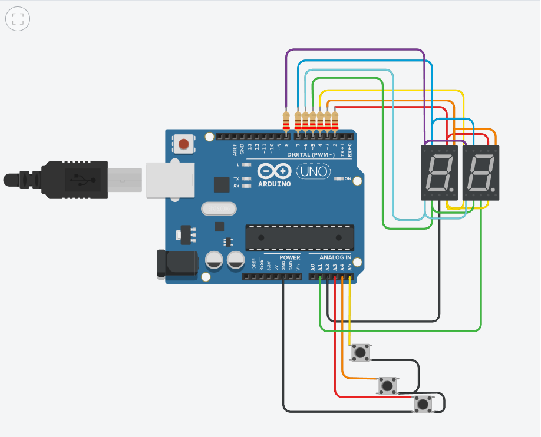

# contador-7-segmentos

## Integrantes 
- Matias Flores
- Lorenzo Buero
- Sol Ghiglieri
- Gabriel Garcia

## Descripción
Es un contador de 2 dígitos hecho con dos displays de 7 segmentos que funcionan a través de multiplexación, que cuenta con los botones sumar, restar y resetear. 

## Función principal
Tiene varias funciones importantes, pero esta es la que se encarga de la multiplexación.

dibujarNumero esta mostrando en los dos display la unidad, en la linea siguiente se apaga el display que representa la decena y luego se apagan ambos. Esto mismo sucede con la decena.

Todo esto ocurre con un delay de 10 milisegundos, y por eso da la ilusión al ojo humano que son dos contadores con valores distintos, cuando en realidad tienen 1 y se van alternando y apagando.

~~~ C (lenguaje en el que esta escrito)
void secuenciaDisplays()
{
  dibujarNumero(contador - 10 * int(contador/10)); // Escribe la unidad en los dos display
  prenderApagarDisplay(UNIDAD); // Apaga la decena, prende las unidades
  prenderApagarDisplay(0); // Borra el numero
  
  dibujarNumero(contador/10); // Calcula la decena
  prenderApagarDisplay(DECENA); // Apaga la unidad, prende solo la decena
  prenderApagarDisplay(0); // Borra el numero
}
~~~

## :robot: Link al proyecto
- [proyecto](https://www.tinkercad.com/things/8P37P67VTbR)
